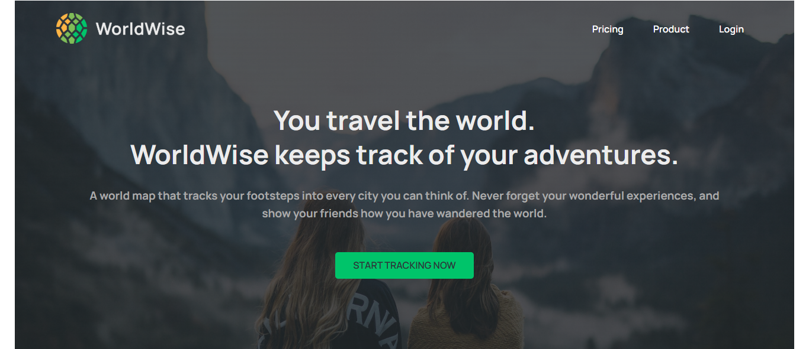
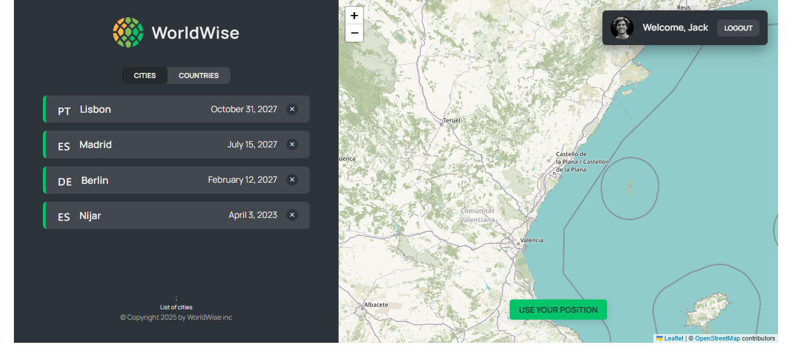
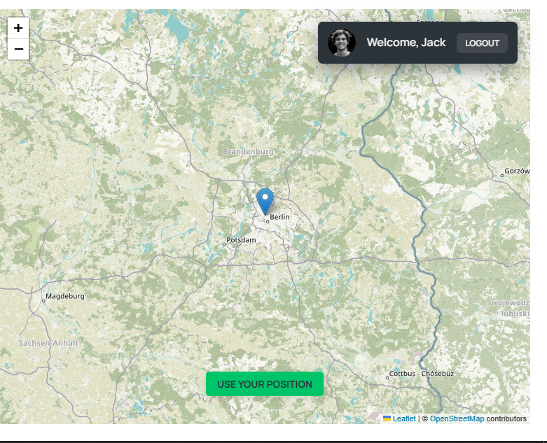
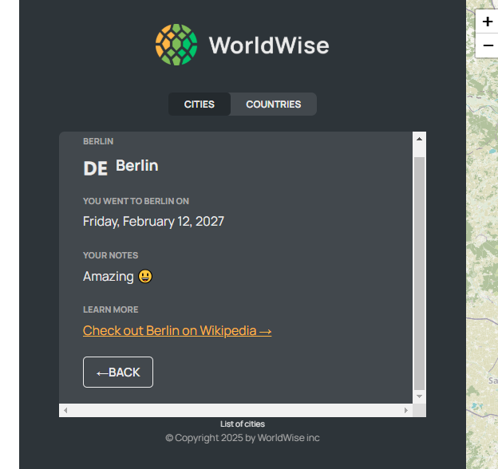
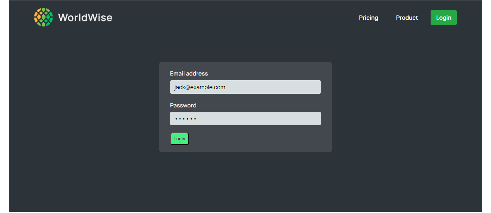
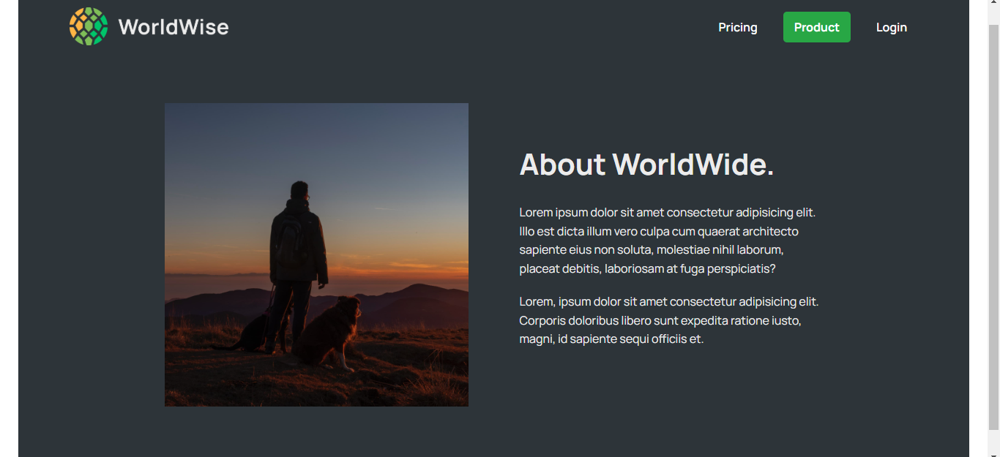
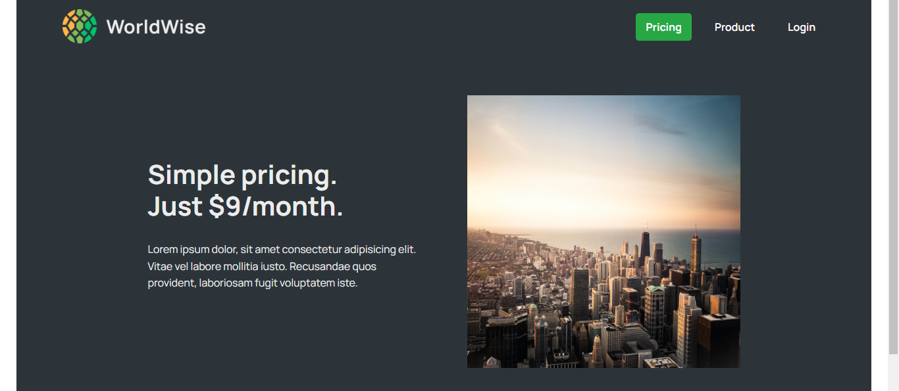
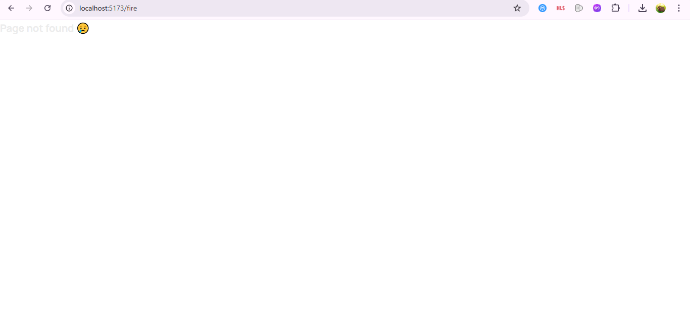

 Pricing, and more:

markdown
Copy
Edit
# 🌍 World Wise  

**World Wise** is a React-based Single Page Application (SPA) that allows users to track and document their travels around the world. It features an interactive map, city and country lists, user authentication, and optimized performance with lazy loading and state management.  

## 🚀 Features  

- 📍 **Map Integration** – Click on a location to add a visited city.  
- 🏙 **City & Country Management** – View a list of visited cities and countries.  
- 🔐 **User Authentication** – Fake authentication system to simulate login/logout.  
- ⏳ **Lazy Loading & Optimization** – Uses `React.lazy()` and `Suspense` for better performance.  
- 🗺 **Geolocation Support** – Auto-detect user location.  
- ⚡ **Context API & Reducers** – Efficient state management for cities and authentication.  
- 🎨 **Modern UI with Tailwind & CSS Modules** – Clean, responsive, and user-friendly design.  

## 📸 Screenshots  

### 🏠 Homepage  
  
*Welcome screen with navigation options.*  

### 📍 City List  
  
*List of visited cities with details.*  

### 🗺️ Map Integration  
  
*Interactive map for adding new cities.*  

### 🏙️ City Details  
  
*Detailed view of a visited city, including a Wikipedia link.*  

### 🔐 Authentication  
  
*Login page with fake authentication system.*  

### 🏷️ Product Page  
  
*Overview of World Wise's features.*  

### 💰 Pricing Page  
  
*Pricing details for World Wise services.*  

### ❌ 404 Page Not Found  
  
*Error page for invalid routes.*  

## 🏗 Tech Stack  

- **Frontend**: React, React Router, Tailwind CSS, CSS Modules  
- **State Management**: Context API, useReducer  
- **Maps**: Leaflet.js  
- **Backend**: JSON Server (for mock API)  
- **Authentication**: FakeAuth Context (Simulated login/logout)  
- **Optimization**: React Lazy Loading, Memoization (`useMemo`, `useCallback`)  

## 📂 Project Structure  

WorldWise/ │── public/ # Public assets (screenshots, images, logo) │── src/ │ ├── components/ # Reusable UI components (Navbar, Buttons, etc.) │ ├── contexts/ # Context API (State Management) │ ├── hooks/ # Custom hooks │ ├── pages/ # Application pages (Home, Login, AppLayout, Product, Pricing) │ ├── data/ # Mock database (cities.json) │ ├── App.js # Main application file │ ├── index.js # Entry point │── README.md # Documentation │── package.json # Dependencies & scripts │── .gitignore # Files to ignore in Git

bash
Copy
Edit

## 🎯 Installation & Setup  

1️⃣ **Clone the repository**  
```bash
git clone https://github.com/yourusername/worldwise.git
cd worldwise
2️⃣ Install dependencies

bash
Copy
Edit
npm install
3️⃣ Start the mock server (for city data)

bash
Copy
Edit
npx json-server --watch src/data/cities.json --port 8000
4️⃣ Run the development server

bash
Copy
Edit
npm start
The app will be available at http://localhost:3000.

📌 Usage
Sign in using the fake credentials:
Email: jack@example.com
Password: qwerty
Click on the map to add a city.
View your visited cities and countries.
Click on a city for more details, including a Wikipedia link.
Delete cities if needed.
📜 License
This project is open-source under the MIT License.

🎯 Built with love by Zakariya Mohamed💙